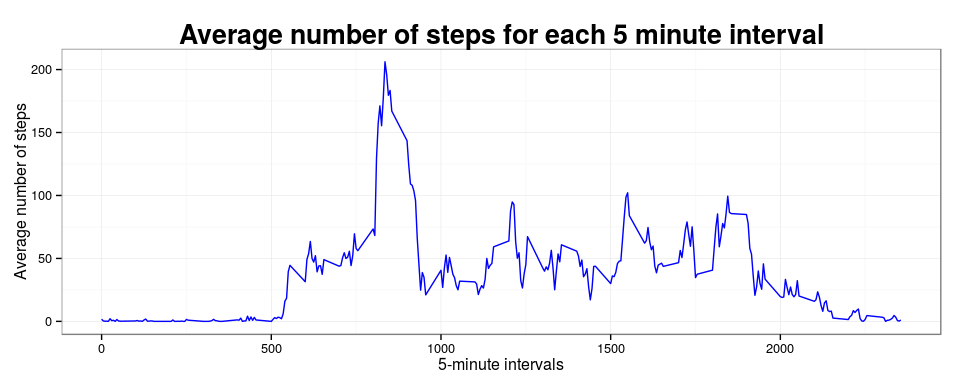

# Reproducible Research: Peer Assessment 1


## Loading and preprocessing the data

```r
library(ggplot2)
library(scales)
if(!file.exists("activity.zip")){
  fileUrl <- "https://d396qusza40orc.cloudfront.net/repdata%2Fdata%2Factivity.zip"
  download.file(fileUrl, destfile = "activity.zip", method = "curl")
  unzip("activity.zip")
}
txt <-"activity.csv"
activity <- read.csv(txt)
```


## What is mean total number of steps taken per day?


```r
steps_by_date<-aggregate(steps~date,activity,sum)

steps_by_date$date = as.Date(steps_by_date$date)
x<-ggplot(steps_by_date, aes(date,steps))+
  geom_bar(stat="identity",fill="blue",width=0.8,colour="black")+
  theme_bw()+
  theme(axis.text.x = element_text(angle=90),
          plot.title = element_text(color="BLACK", size=20, face="bold"))+ 
  scale_x_date(labels=date_format("%Y-%m-%d"), breaks = "2 days")+
  ggtitle("Total number of steps taken each day")+
  ylab("Number of steps")
print(x)
```

<!-- -->

```r
mean(steps_by_date$steps)
```

```
## [1] 10766.19
```

```r
median(steps_by_date$steps)
```

```
## [1] 10765
```

The mean of steps is **10766.19** and the median is **10765**.


## What is the average daily activity pattern?

```r
intervals_by_steps<-aggregate(steps~interval,activity,mean)

ggplot(intervals_by_steps, aes(interval,steps))+
   geom_line()+theme_bw()+  
   theme(plot.title = element_text(color="BLACK", size=20, face="bold"))+ 
   ggtitle("Average number of steps for each 5 minute interval")+
   ylab("Average number of steps")+
   xlab("5-minute intervals")
```

<!-- -->

The 5-minute interval that, on average, contains the maximum number of steps


```r
max(intervals_by_steps$steps)
```

```
## [1] 206.1698
```

## Imputing missing values

```r
impute_activity<-merge(activity,intervals_by_steps,by.x="interval",by.y="interval")
names(impute_activity)[names(impute_activity)=="steps.x"] <- "steps"
names(impute_activity)[names(impute_activity)=="steps.y"] <- "avg"
ndx <- is.na(impute_activity$steps)
impute_activity[ndx,]$steps <- impute_activity[ndx,]$avg
impute_steps_by_date<-aggregate(steps~date,impute_activity,sum)
impute_steps_by_date$date = as.Date(impute_steps_by_date$date)
x<-ggplot(impute_steps_by_date, aes(date,steps))+
  geom_bar(stat="identity",fill="blue",width=0.8,colour="black")+
  theme_bw()+
  theme(axis.text.x = element_text(angle=90),
        plot.title = element_text(color="BLACK", size=20, face="bold"))+ 
  scale_x_date(labels=date_format("%Y-%m-%d"), breaks = "2 days")+
  ggtitle("Total number of steps taken each day (imputing missing data case)")+
  ylab("Number of steps")
print(x)
```

<!-- -->

```r
mean(impute_steps_by_date$steps)
```

```
## [1] 10766.19
```

```r
median(impute_steps_by_date$steps)
```

```
## [1] 10766.19
```


## Are there differences in activity patterns between weekdays and weekends?


```r
wd <- c("weekend","weekday","weekday","weekday","weekday","weekday","weekend")
impute_activity$week <- wd[as.POSIXlt(impute_activity$date)$wday+1]
intervals_by_steps<-aggregate(steps~interval+week,impute_activity,mean)
x<-ggplot(intervals_by_steps, aes(interval,steps))+
  geom_line()+theme_bw()+  
  theme(plot.title = element_text(color="BLACK", size=20, face="bold"))+ 
  ggtitle("Average number of steps for each 5 minute interval")+
  ylab("Average number of steps")+
  xlab("5-minute intervals")+
  facet_grid(week ~ .)

print(x)
```

<!-- -->

