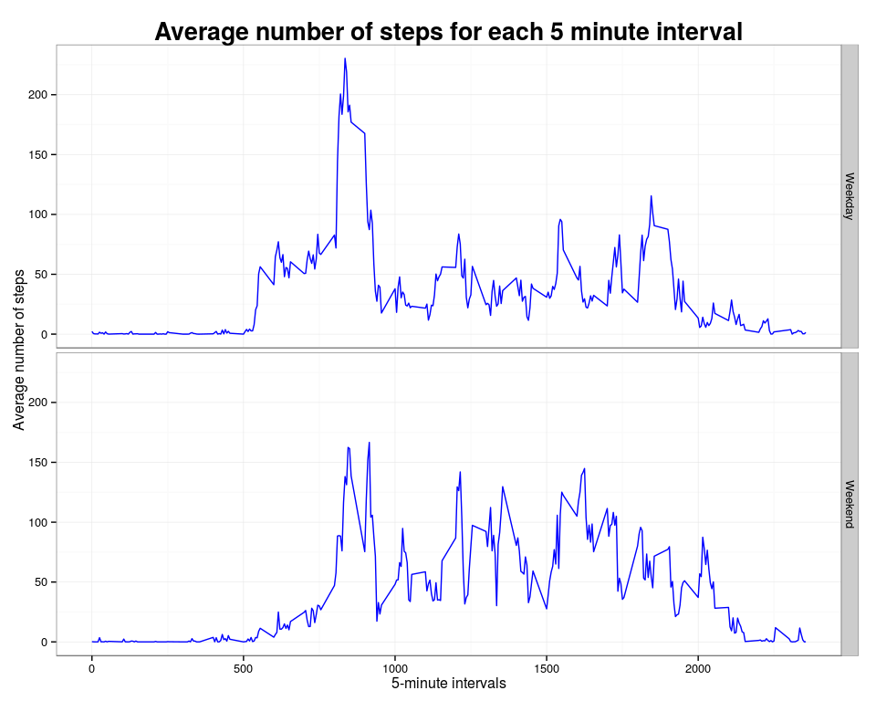

# Reproducible Research: Peer Assessment 1

*This assignment makes use of data from a personal activity monitoring device. This device collects data at 5 minute intervals through out the day. The data consists of two months of data from an anonymous individual collected during the months of October and November, 2012 and include the number of steps taken in 5 minute intervals each day.*  

Activity.csv contains 3 variables:  

1. **steps**: Number of steps taking in a 5-minute interval (missing values are coded as NA)
2. **date**: The date on which the measurement was taken in YYYY-MM-DD format
3. **interval**: Identifier for the 5-minute interval in which measurement was taken

## Loading and preprocessing the data
1. Load the libraries used for this assessment

```r
library(ggplot2)
library(scales)
```
2. Load the dataset

```r
if(!file.exists("activity.zip")){
  fileUrl <- "https://d396qusza40orc.cloudfront.net/repdata%2Fdata%2Factivity.zip"
  download.file(fileUrl, destfile = "activity.zip", method = "curl")
  unzip("activity.zip")
}
txt <-"activity.csv"
activity <- read.csv(txt)
activity$date <- as.Date(activity$date)
```

## What is mean total number of steps taken per day?
1. Calculate the total number of steps taken per day

```r
steps_by_day<-aggregate(steps~date,activity,sum)
```
2. Make a histogram of the total number of steps taken ber day

```r
x<-ggplot(steps_by_day, aes(date,steps)) +
  geom_bar(stat="identity",fill="blue",width=0.8,colour="black") +
  theme_bw() +
  theme(axis.text.x = element_text(angle=90),
        plot.title  = element_text(color="BLACK", size=20, face="bold")) + 
  scale_x_date(labels=date_format("%Y-%m-%d"), breaks = "2 days") +
  ggtitle("Total number of steps taken each day") +
  ylab("Number of steps")
print(x)
```

<!-- -->
3. Calculate and report the mean and median of the total number of steps taken per day 

```r
mean(steps_by_day$steps)
```

```
## [1] 10766.19
```

```r
median(steps_by_day$steps)
```

```
## [1] 10765
```

*The mean of total number of steps taken per day is* **10766.19** *and the median is* **10765**.

## What is the average daily activity pattern?
1. Make a time series plot of the 5-minute interval (x-axis) and the average number of steps taken, averaged across all days (y-axis)

```r
intervals_by_steps<-aggregate(steps~interval,activity,mean)

ggplot(intervals_by_steps, aes(interval,steps))+
   geom_line(color="blue")+theme_bw()+  
   theme(plot.title = element_text(color="BLACK", size=20, face="bold"))+ 
   ggtitle("Average number of steps for each 5 minute interval")+
   ylab("Average number of steps")+
   xlab("5-minute intervals")
```

<!-- -->
2. Which 5-minute interval, on average across all the days in the dataset, contains the maximum number of steps?


```r
max(intervals_by_steps$steps)
```

```
## [1] 206.1698
```
*The maximum average number of steps is* **206.1698**

## Imputing missing values
1. Calculate and report the total number of missing values in the dataset

```r
length(which(is.na(activity$steps)))
```

```
## [1] 2304
```

```r
length(which(is.na(activity$date)))
```

```
## [1] 0
```

```r
length(which(is.na(activity$interval)))
```

```
## [1] 0
```
*The number of missing values is* **2304** *that it corresponds to steps variable in dataset. The other variables in dataset not contain missing values*.

2. Devise a strategy for filling in all of the missing values in the dataset.  
*Each missing value in steps is replaced with the mean for the 5-minute interval that corresponds for each value.* 
3. Create a new dataset that is equal to the original dataset but with the missing data filled in.


```r
impute_activity<-merge(activity,intervals_by_steps,by.x="interval",by.y="interval")
names(impute_activity)[names(impute_activity)=="steps.x"] <- "steps"
names(impute_activity)[names(impute_activity)=="steps.y"] <- "avg"
ndx <- is.na(impute_activity$steps)
impute_activity[ndx,]$steps <- impute_activity[ndx,]$avg
impute_steps_by_day<-aggregate(steps~date,impute_activity,sum)
```
4. Make a histogram of the total number of steps taken each day.

```r
x<-ggplot(impute_steps_by_day, aes(date,steps))+
  geom_bar(stat="identity",fill="blue",width=0.8,colour="black")+
  theme_bw()+
  theme(axis.text.x = element_text(angle=90),
        plot.title = element_text(color="BLACK", size=20, face="bold"))+ 
  scale_x_date(labels=date_format("%Y-%m-%d"), breaks = "2 days")+
  ggtitle("Total number of steps taken each day (imputing missing values)")+
  ylab("Number of steps")
print(x)
```

<!-- -->
Calculate and report the mean and median total number of steps taken per day.

```r
mean(impute_steps_by_day$steps)
```

```
## [1] 10766.19
```

```r
median(impute_steps_by_day$steps)
```

```
## [1] 10766.19
```
*The mean of total number of steps taken per day is* **10766.19** *and the median is* **10766.19**.

Do these values differ from the estimates from the first part of the assignment?  
*Yes, these values do differ slightly. The mean value is the same and the median is slightly different*

What is the impact of imputing missing data on the estimates of the total daily number of steps?

*In this case, the imputing strategy for the missing data does not impact in the total daily number of steps.*

## Are there differences in activity patterns between weekdays and weekends?
1. Create a new factor variable in the dataset with two levels – “weekday” and “weekend” indicating whether a given date is a weekday or weekend day.

```r
wd <- c("Weekend",rep("Weekday",5),"Weekend")
impute_activity$week <- wd[as.POSIXlt(impute_activity$date)$wday+1]
```
2. Make a panel plot containing a time series plot of the 5-minute interval (x-axis) and the average number of steps taken, averaged across all weekday days or weekend days (y-axis). 


```r
intervals_by_steps<-aggregate(steps~interval+week,impute_activity,mean)
x<-ggplot(intervals_by_steps, aes(interval,steps))+
  geom_line(color="blue")+theme_bw()+  
  theme(plot.title = element_text(color="BLACK", size=20, face="bold"))+ 
  ggtitle("Average number of steps for each 5 minute interval")+
  ylab("Average number of steps")+
  xlab("5-minute intervals")+
  facet_grid(week ~ .)

print(x)
```

<!-- -->

------
